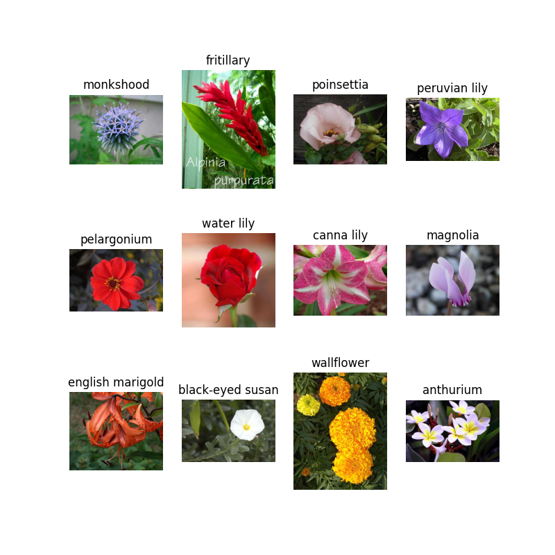
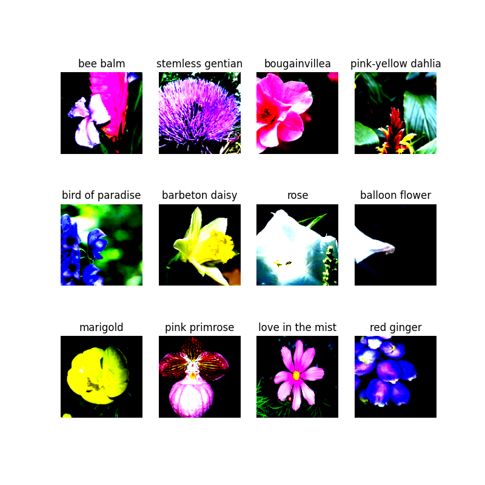

# Image Generation With Diffusion Models
## Team Introduction
**Name**:  Magical Mavericks  
**Members:**  
| Name | Neptun | 
|:---|:---|
| Luu Hai Tung | JF64K7 | 
| Meng Yan | I1MDQ0  | 
| Mengkedalai.Mengkedalai | YHFSZZ | 

## Project Description
### Installation  
* Data Analysis  

Only use <`data_analysis/data_analysis.ipynb`> to check data analysis results.  
* For Whole Project:
1. Install anaconda  
Follow the instruction: [Installation](https://docs.anaconda.com/free/anaconda/install/)
2. Create conda environment:  
Open Anaconda Powershell Prompt and enter the following command.  
create environment:   
`conda create -n your-environment-name python=3.6`    
activate environment:  
`conda activate your-environment-name`
3. install packages:  
`pip install -r requirements.txt`


### Dataset: [FLOWERS102](https://pytorch.org/vision/0.15/generated/torchvision.datasets.Flowers102.html) (Provided By Pytorch)  
* Augmentation Methods

[`RandomResizedCrop`](https://pytorch.org/vision/0.15/generated/torchvision.transforms.v2.RandomResizedCrop.html?highlight=randomresizedcrop#torchvision.transforms.v2.RandomResizedCrop): randomly flip an image horizontally (i.e., about its vertical axis) with a given probability. 
This helps in increasing the diversity of the training data, making the model more robust. 

[`RandomHorizontalFlip`](https://pytorch.org/vision/0.15/generated/torchvision.transforms.v2.RandomHorizontalFlip.html?highlight=randomhorizontalflip#torchvision.transforms.v2.RandomHorizontalFlip): randomly flip an image horizontally (i.e., about its vertical axis) with a given probability. 
This helps in increasing the diversity of the training data, making the model more robust.  

[`Normalize`](https://pytorch.org/vision/0.15/generated/torchvision.transforms.v2.Normalize.html?highlight=normalize#torchvision.transforms.v2.Normalize): randomly flip an image horizontally (i.e., about its vertical axis) with a given probability. 
This helps in increasing the diversity of the training data, making the model more robust.  

* Data Preparation  

Training dataset: 102 classes, each class include 10 images

Validation dataset: 102 classes, each class include 10 images

* Visualization  

Original Image:


Augmented Image:



### Reference
```
@article{ho2020denoising,  
  title={Denoising diffusion probabilistic models},
  author={Ho, Jonathan and Jain, Ajay and Abbeel, Pieter},  
  journal={Advances in neural information processing systems},  
  volume={33},
  pages={6840--6851},
  year={2020}
}
```