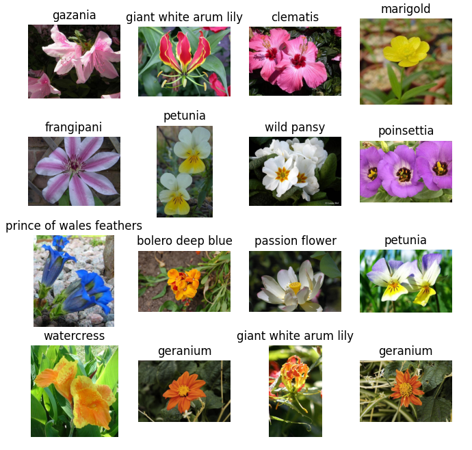

# Image Generation With Diffusion Models

# Contents  
- [Team Introduction](#team-introduction)  
- [Project Installation](#project-installation)  
- [Milestone 1: data acqusition, data preparation](#milestone-1-data-acqusition-data-preparation)  
  - [Data Analysis](#data-analysis) 
  - [Data Preparation](#data-preparation) 
- [Milestone 2: baseline evaluation, baseline model](#milestone-2-baseline-evaluation-baseline-model)  
  - [Dataset](#dataset) 
  - [Model](#Model) 
  - [Run Project](#run-project)
  - [Visualization Result](#visualization-result)
- [Reference](#reference) 


## Team Introduction
**Name**:  Magical Mavericks  
**Members:**  
| Name | Neptun | 
|:---|:---|
| Luu Hai Tung | JF64K7 | 
| Meng Yan | I1MDQ0  | 
| Mengkedalai.Mengkedalai | YHFSZZ | 

## Project Installation

* Data Analysis

Only use <`data_analysis/data_analysis.ipynb`> to check data analysis results.  

* For Whole Project:
1. Install anaconda  
Follow the instruction: [Installation](https://docs.anaconda.com/free/anaconda/install/)
2. Create conda environment:  
Open Anaconda Powershell Prompt and enter the following command.  
create environment:   
`conda create -n your-environment-name python=3.8`    
activate environment:  
`conda activate your-environment-name`
3. install pytorch: (We are using the latest version of pytorch (2.1.0), make sure your NVIDIA cuda-version is more than 11.8. If not, please upgrade your NVIDIA cuda version first.) 
`conda install pytorch torchvision torchaudio pytorch-cuda=11.8 -c pytorch -c nvidia`  
4. install packages:  
`pip install -r requirements.txt`


## Milestone 1: data acqusition, data preparation


### Data Analysis

Dataset: [FLOWERS102](https://pytorch.org/vision/0.15/generated/torchvision.datasets.Flowers102.html) (Provided By Pytorch) 

* Augmentation Methods

[`RandomResizedCrop`](https://pytorch.org/vision/0.15/generated/torchvision.transforms.v2.RandomResizedCrop.html?highlight=randomresizedcrop#torchvision.transforms.v2.RandomResizedCrop): 
Randomly crop sub-images of different areas in the original image and resize these sub-images to the specified size.
Introducing randomness into the training data improves the robustness and generalization ability of the model

[`RandomHorizontalFlip`](https://pytorch.org/vision/0.15/generated/torchvision.transforms.v2.RandomHorizontalFlip.html?highlight=randomhorizontalflip#torchvision.transforms.v2.RandomHorizontalFlip): 
Randomly flip an image horizontally with a given probability. 
This helps in increasing the diversity of the training data, making the model more robust.  

[`Normalize`](https://pytorch.org/vision/0.15/generated/torchvision.transforms.v2.Normalize.html?highlight=normalize#torchvision.transforms.v2.Normalize): 
Scale the pixel values of the image to a specific range. So that the model can better learn image features and improve the stability and effect of training 

* Balance Of Dataset

Training dataset: 102 classes, each class include 10 images

Validation dataset: 102 classes, each class include 10 images

* Visualization  

Original Image:  


Augmented Image:  


### Data Preparation   

For the diffusion process, we do not really need the labels.   
Instead, the common loss is negative log-likelihood function to measure the discrepancy between 2 distributions.

Original Image:  


Noisy Image:  


___

## Milestone 2: baseline evaluation, baseline model

### Dataset: 
[CIFAR10](https://pytorch.org/vision/main/generated/torchvision.datasets.CIFAR10.html) (Provided By Pytorch)  
used built-in function to efficient in loading the data

### Model


There is a schematic representation of a machine learning model that involves a diffusion process and a denoising U-Net architecture.
The overall model is a generative one,  for creating images  that can be conditioned on various forms of auxiliary information  to guide the generation process. The model incorporates modern neural network components like the U-Net and attention mechanisms to process and generate data.


Add noisy: gaussian_diffusion
Loss: FID+IS

### Run Project

* train:  run ``python main.py``


* evaluation run ``python test.py``


### Visualization Result

Train Result:


Test Result:


___

## Reference
```
@article{ho2020denoising,  
  title={Denoising diffusion probabilistic models},
  author={Ho, Jonathan and Jain, Ajay and Abbeel, Pieter},  
  journal={Advances in neural information processing systems},  
  volume={33},
  pages={6840--6851},
  year={2020}
}
@inproceedings{nichol2021improved,
  title={Improved denoising diffusion probabilistic models},
  author={Nichol, Alexander Quinn and Dhariwal, Prafulla},
  booktitle={International Conference on Machine Learning},
  pages={8162--8171},
  year={2021},
  organization={PMLR}
}
```