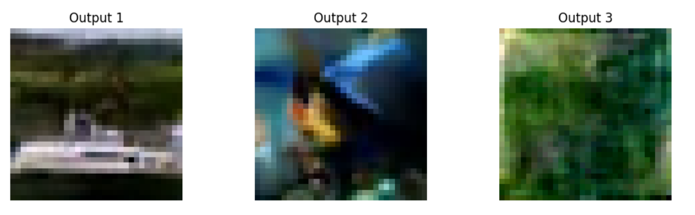
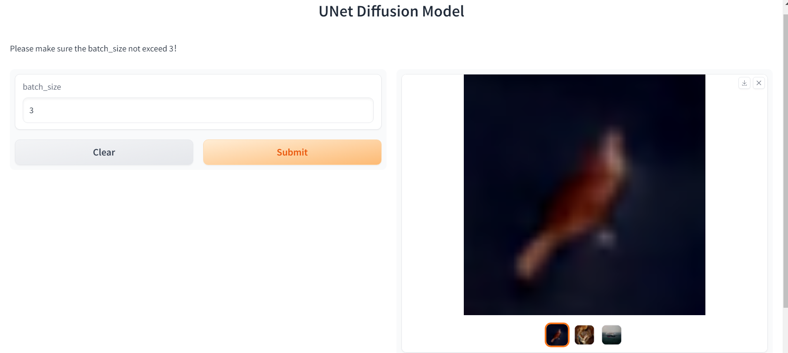

# Image Generation With Diffusion Models

# Contents  
- [Team Introduction](#team-introduction)  
- [Project Installation](#project-installation)  
- [Milestone 1: data acqusition, data preparation](#milestone-1-data-acqusition-data-preparation)  
  - [Data Analysis](#data-analysis) 
  - [Data Preparation](#data-preparation) 
- [Milestone 2: baseline evaluation, baseline model](#milestone-2-baseline-evaluation-baseline-model)  
  - [Dataset](#dataset) 
  - [Model](#Model) 
  - [Run Project](#run-project)
  - [Visualization Result](#visualization-result)
- [Final Submission](#final-submission)  
  - [Evaluation](#evaluation) 
  - [Front end UI](#front-end-ui) 
  - [Documentation](#documentation) 
- [Reference](#reference) 


## Team Introduction
**Name**:  Magical Mavericks  
**Members:**  
| Name | Neptun | 
|:---|:---|
| Luu Hai Tung | JF64K7 | 
| Meng Yan | I1MDQ0  | 
| Mengkedalai.Mengkedalai | YHFSZZ | 

## Project Installation

* Data Analysis

Only use [`data_analysis/data_analysis.ipynb`](https://github.com/MengYan0901/DL_Homework/blob/main/data_analysis/data_analysis.ipynb) to check data analysis results.  

* For Whole Project:
1. Install anaconda  
Follow the instruction: [Installation](https://docs.anaconda.com/free/anaconda/install/)
2. Create conda environment:  
Open Anaconda Powershell Prompt and enter the following command.  
create environment:   
`conda create -n your-environment-name python=3.8`    
activate environment:  
`conda activate your-environment-name`
3. install pytorch: (We are using the latest version of pytorch (2.1.0), make sure your NVIDIA cuda-version is more 
4. than 11.8. If not, please upgrade your NVIDIA cuda version first.) 
`conda install pytorch torchvision torchaudio pytorch-cuda=11.8 -c pytorch -c nvidia`  
5. install packages:  
`pip install -r requirements.txt`


## Milestone 1: data acqusition, data preparation


### Data Analysis

Dataset: [FLOWERS102](https://pytorch.org/vision/0.15/generated/torchvision.datasets.Flowers102.html) (Provided 
By Pytorch) 

* Augmentation Methods


[`RandomResizedCrop`](https://pytorch.org/vision/0.15/generated/torchvision.transforms.v2.RandomResizedCrop.html?highlight=randomresizedcrop#torchvision.transforms.v2.RandomResizedCrop):
Randomly crop sub-images of different areas in the original image and resize these sub-images to the specified size.
Introducing randomness into the training data improves the robustness and generalization ability of the model

[`RandomHorizontalFlip`](https://pytorch.org/vision/0.15/generated/torchvision.transforms.v2.RandomHorizontalFlip.html?highlight=randomhorizontalflip#torchvision.transforms.v2.RandomHorizontalFlip): 
Randomly flip an image horizontally with a given probability. 
This helps in increasing the diversity of the training data, making the model more robust.  

[`Normalize`](https://pytorch.org/vision/0.15/generated/torchvision.transforms.v2.Normalize.html?highlight=normalize#torchvision.transforms.v2.Normalize): 
Scale the pixel values of the image to a specific range. So that the model can better learn image features and improve 
the stability and effect of training 

* Balance Of Dataset

Training dataset: 102 classes, each class include 10 images

Validation dataset: 102 classes, each class include 10 images

* Visualization  

Original Image:  


Augmented Image:  


### Data Preparation   

For the diffusion process, we do not really need the labels.   
Instead, the common loss is negative log-likelihood function to measure the discrepancy between 2 distributions.

Original Image:  


Noisy Image:  


___

## Milestone 2: baseline evaluation, baseline model

### Dataset: 
[CIFAR10](https://pytorch.org/vision/main/generated/torchvision.datasets.CIFAR10.html) (Provided By Pytorch)  
use built-in function to efficient in loading the data

### Model
* Baseline Model: [SNGAN-DDLS](https://proceedings.neurips.cc/paper/2020/hash/90525e70b7842930586545c6f1c9310c-Abstract.html)

* Project Model: [U-Net](https://proceedings.neurips.cc/paper/2020/hash/4c5bcfec8584af0d967f1ab10179ca4b-Abstract.html)

Image Diffusion and Inverse Process Over Time Steps:


Denoising U-Net Architecture for Conditional Diffusion Models:  
     
The overall model is a diffusion model, aims to learn the noise distribution and denoise the noise in the image.

* Metrics: [FID](https://pytorch.org/ignite/generated/ignite.metrics.FID.html)
+IS (evaluate how well the model perform)

### Run Project

* train:  run ``python main.py``


* evaluation run ``python test.py``

### Visualization Result

Train Processing:    


    
Test Result:    


___

## Final Submission

### Evaluation   
For the evaluation result, check the [`evaluation/evaluation_UI.ipynb`](https://github.com/MengYan0901/DL_Homework/blob/main/evaluation/evaluation%2BUI.ipynb) notebook.

Our Model Test Result:        
     
[Other's Model](https://github.com/pesser/pytorch_diffusion) Test Result:              


### Front-end UI
We can change the batch-size of the images inputting in the model, from 1 to 3. (If the batch-size is bigger, using our model maybe can not get better results. Because with larger batch-size, the model may need larger step to denoise it.)    
   
Interface Result:    


### Documentation
Our [Documentation](https://github.com/MengYan0901/DL_Homework/blob/main/results/Documentation-DeepLearning.pdf)!        


## Reference
```
@article{ho2020denoising,  
  title={Denoising diffusion probabilistic models},
  author={Ho, Jonathan and Jain, Ajay and Abbeel, Pieter},  
  journal={Advances in neural information processing systems},  
  volume={33},
  pages={6840--6851},
  year={2020}
}
@inproceedings{nichol2021improved,
  title={Improved denoising diffusion probabilistic models},
  author={Nichol, Alexander Quinn and Dhariwal, Prafulla},
  booktitle={International Conference on Machine Learning},
  pages={8162--8171},
  year={2021},
  organization={PMLR}
}
@article{che2020your,
  title={Your gan is secretly an energy-based model and you should use discriminator driven latent sampling},
  author={Che, Tong and Zhang, Ruixiang and Sohl-Dickstein, Jascha and Larochelle, Hugo and Paull, Liam and Cao, Yuan and Bengio, Yoshua},
  journal={Advances in Neural Information Processing Systems},
  volume={33},
  pages={12275--12287},
  year={2020}
}
```